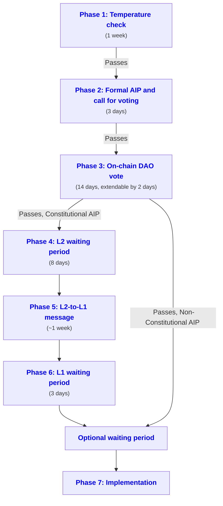

import DraftExpectationsPartial from '@site/docs/partials/_draft-expectations-partial.md'; 

<DraftExpectationsPartial />

An <a data-quicklook-from="arbitrum-improvement-proposal-aip">Arbitrum Improvement Proposal (AIP)</a> is a proposal submitted by a member of the Arbitrum DAO that proposes a change to the Arbitrum ecosystem. There are two types of AIPs: <a data-quicklook-from="constitutional-aip">Constitutional</a> and <a data-quicklook-from="nonconstitutional-aip">non-Constitutional</a>:

- **Constitutional AIPs** are those that modify the text or procedures of the Constitution or AIP-1, install or modify software on any chain, or take any action that requires "chain owner" permission on any chain. 
- **Non-Constitutional AIPs** are all other AIPs, such as those that request funds/grants or provide general guidelines or information to the community.

In this conceptual overview, we'll evaluate the lifecycle and anatomy of both types of AIPs.

### The anatomy of an Arbitrum Improvement Proposal (AIP)

import AnatomyAIPPartial from '@site/docs/partials/_anatomy-aip-partial.md'; 

<AnatomyAIPPartial />

### The lifecycle of an Arbitrum Improvement Proposal

#### Technical overview

For a technical overview of implementation details, visit the [Governance Repo](https://github.com/ArbitrumFoundation/governance/tree/main/docs):
  - [Governance Action Contracts](https://github.com/ArbitrumFoundation/governance/blob/main/src/gov-action-contracts/README.md)
  - [Arbitrum Governance: Technical Overview](https://github.com/ArbitrumFoundation/governance/blob/main/docs/overview.md)
  - [Proposal Lifecycle Example](https://github.com/ArbitrumFoundation/governance/blob/main/docs/proposal_lifecycle_example.md)
  - [Roundtrip Governance - Diagram](https://github.com/ArbitrumFoundation/governance/blob/main/docs/roundtrip-governance.png)

#### High-level overview

The proposal submission process starts with a temperature check, where the AIP is suggested on the Arbitrum DAO governance forum along with a Snapshot poll. It's discussed/debated for 1 week. If the AIP passes the temperature check, it moves on to the next phase, which is the formal AIP and call for voting. In this phase, the AIP is submitted via governance contracts on Arbitrum One via [Tally](https://tally.xyz/gov/arbitrum)'s user interface. After 3 days, a voter distribution snapshot is taken and the voting period begins.

Each AIP must be labeled as Constitutional or non-Constitutional, and must also clearly specify which Arbitrum DAO-governed chain(s) it will affect. If the AIP passes, it moves through a series of phases that include L2 and L1 waiting periods, and eventually, the implementation of the proposal. This process typically takes 34 days for a Constitutional AIP or 21 days for a Non-Constitutional AIP, but may take longer if specified by the AIP.

#### Phase 1: Temperature check (optional but recommended) - 1 week in duration

This is the first phase of the Arbitrum Improvement Proposal (AIP) process: 

 1. The proposed AIP is submitted following the procedure outlined within [How to submit a DAO proposal](../how-tos/create-submit-dao-proposal).
 2. A discussion is initiated on the [Arbitrum DAO governance forum](https://forum.arbitrum.foundation/c/proposals/7).
 3. A Snapshot poll is created to help gauge the interest of Arbitrum DAO members - either at the same time as the forum post, or after the forum post has facilitated initial discussion. This poll can be initiated only by an address that can represent at least 0.01% of the votable tokens.
 4. The poll runs for 7 days and is decided by a simple majority with no required participation threshold.

This is an optional step, but it's recommended as a due-diligence governance best practice. If an AIP fails this temperature check, the original AIP author is encouraged to refrain from proceeding, and voters are encouraged to reject it if the author proceeds. If an AIP proposer decides to skip this step, voters should consider this as a factor in their vote.

#### Phase 2: Formal AIP and call for voting - 3 days in duration

In this phase, the AIP is officially submitted via governance smart contracts on the Arbitrum One chain. The proposer of the AIP must have an address that can represent at least 1,000,000 votable tokens. After the AIP is submitted, there's a 3-day period for interested parties to discuss the proposal and gather votes before a voter distribution snapshot is taken. During this phase, the AIP must be labeled as either <a data-quicklook-from='constitutional-aip'>Constitutional</a> or <a data-quicklook-from='nonconstitutional-aip'>Non-Constitutional</a>. Additionally, the AIP must clearly specify which Arbitrum DAO-governed chain(s) it will affect. This phase is important as it defines a clear, formal protocol for proposing and voting on AIPs.

#### Phase 3: On-chain DAO vote - 14-16 days in duration

During this phase, members of the Arbitrum DAO can vote directly on-chain for (or against) a submitted AIP. For the AIP to pass, more Votable Tokens must vote in favor than against, and a certain percentage of all Votable Tokens must vote in favor. This percentage is 5% for Constitutional AIPs and 3% for Non-Constitutional AIPs, and is referred to as "Threshold 2" within the [Constitution](../dao-constitution.md).

The voting period for an AIP ends 14 days after it starts. However, if Threshold 2 is reached within the last 2 days of the voting period, the voting period is extended by 2 days. If the AIP fails to pass, the process ends after this Phase 3. If it does pass, Constitutional AIPs move on to Phases 4 through 7, while Non-Constitutional AIPs skip Phases 4 through 6 and go straight to Phase 7.

#### Phase 4: L2 waiting period - 8 days in duration

After an AIP passes Phase 3 of the voting process, there is a 3-day waiting period known as Phase 4. During this time, people who do not agree with the AIP have the chance to withdraw their funds or take other action on L2. This period is meant to give everyone time to consider the decision and make any necessary adjustments to their investments or actions.

Once the 3-day waiting period is over, the AIP will move on to the next phase of the voting process, as long as no major issues arise. This waiting period is important because it ensures that everyone has an opportunity to voice their concerns and recalibrate their participation before the AIP is finalized.

#### Phase 5: L2-to-L1 message - typically 1 week in duration

Once the 3-day waiting period of Phase 4 has passed and an AIP has been approved, Phase 5 of the voting process begins. In this phase, an [L2-to-L1 message](https://developer.arbitrum.io/arbos/l2-to-l1-messaging) is sent indicating that the AIP has passed. This message is sent to L1, which is the main Ethereum blockchain. Once the message is finalized on L1 (this takes at least 1 week), anyone can redeem it to complete this step and move on to the next step of the process. This ensures that the completion of the L2 waiting period will be recognized on L1 after any withdrawals initiated during or soon after the voting period have been recognized on L1. Note that this could take longer if there is an on-going challenge to a assertion made by an Arbitrum validator.

This phase is important because it connects the Arbitrum blockchain, which is a Layer 2 (or L2) blockchain, to the main Ethereum blockchain, which is the L1 chain. This connection gives DAO members a guarantee that the DAO's decision (and its members' votes) is immutably recorded. This is an important step in the process of decentralized decision-making because it ensures that everyone can trust-but-verify the outcome of the voting process.

#### Phase 6: L1 waiting period - 3 days in duration

After Phase 5 of the voting process, where the decision is recorded on the Ethereum mainnet, the process enters Phase 6, which is a 3-day waiting period. This waiting period ensures that in-progress transactions have enough time to finalize on mainnet before the AIP is implemented.

This waiting period is important because it minimizes the risk of an AIP negatively impacting transactions that were initiated prior to the DAO's approval of the AIP. Once this waiting period is over, the AIP takes effect.

#### Phase 7: Implementation

Phase 7 is the final step in the voting process in which an approved AIP is fully executed and implemented. An AIPs implementation can happen in one of two ways. It can happen directly on Ethereum mainnet, or via a transaction sent from L1 to one or more of the Layer 2 chains that are governed by the Arbitrum DAO. This L1-to-L2 mechanism ensures that changes made by an approved AIP are recognized and supported on both L1 and L2 chains. Once the AIP has been fully executed and implemented, its changes will be active until another AIP is passed to make further changes.

#### Additional waiting periods (optional)

When an AIP is passed, it means that changes are going to be made to the Arbitrum DAO's governance system. These changes can be "breaking changes" - changes that cause other parts of the governance system (or third-party systems) to stop working or behave differently. 

To ensure that the owners of these downstream dependencies have enough time to adjust to these types of changes, proposal submitters may optionally specify an extra waiting period that needs to be honored before the AIP's changes take effect. This is recommended for AIPs that require Arbitrum DAO's stakeholders to spend some time preparing for the AIP's proposed changes. This mechanism helps ensure that both Arbitrum DAO's systems and third-party systems can remain available and stable during and after any given AIP's implementation.

### Conclusion

The entire AIP voting process, including all seven phases, typically takes 37 days to complete for Constitutional AIPs, or 27 days for Non-Constitutional AIPs, from the start of the temperature check in Phase 1. This process is designed to allow for thorough consideration and voting, ensuring that everyone has a fair chance to voice their opinions and concerns.

This conceptual overview presents a beginner-friendly elaboration upon the AIP process detailed within [The Constitution of the Arbitrum DAO](../dao-constitution.md). This process is designed to ensure that proposed changes align with the Arbitrum community's mission and guiding values, and that the community's various stakeholders have the opportunity to discuss, debate, vote on, and prepare for proposed changes before they're ultimately implemented.
