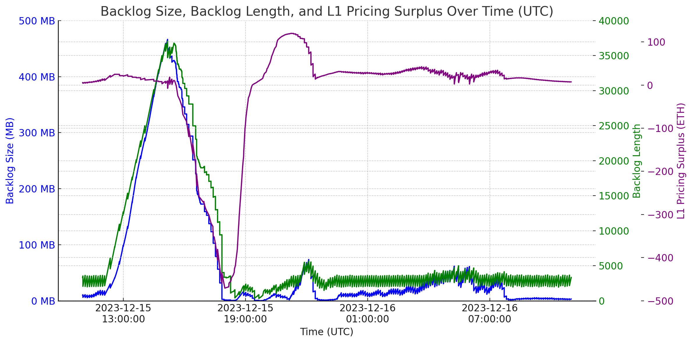

# Post-Mortem Report: Sequencer Downtime and L1 Gas Pricing Issue
  
On December 15th, the Arbitrum One Sequencer experienced an outage, resulting in an interruption to regular traffic and downstream issues with gas pricing. During the incident, the Offchain Labs team, on behalf of the Arbitrum Foundation, actively led an investigation and resolution. While the incident has been resolved, the following is a detailed summary of events, including root cause analysis, learnings, and steps put in place to mitigate future scenarios. Also included below are comprehensive timelines related to the incident. It is recognized that this event had a negative impact on users, both in terms of reduced ability to conduct transactions and a spike in gas fees, but any transactions that did receive a successful confirmation during the interruption were eventually processed.

In the morning of December 15th, the Arbitrum One batch poster (which posts transaction data to Ethereum) formed a backlog due to an issue with an Ethereum consensus client that the sequencer was relying on and the way the backlog was being monitored, leading to the batch poster not being able to keep up. The growth of the backlog was exacerbated by the high volume of inscriptions being minted at the time. Once the backlog reached a certain size, the feed component of the sequencer failed, leading to a loss of connection for 3rd party node providers in addition to the public RPC fleet. During this time, users submitting transactions had chain data that was out-of-sync, and as a result, transactions would fail. As a response, a development version of the node software that was already in testing was built, deployed, and tested on Arbitrum Sepolia. After additional internal testing, the new build was deployed to the Arbitrum One sequencer, which immediately regained normal functionality.

During this time of increased activity, large and growing backlog, and investigation into the sequencer, the onchain pricing system undercharged users at high volume. On Arbitrum chains, the protocol automatically and trustlessly <u>[adjusts the L1 data price](https://docs.arbitrum.io/arbos/l1-pricing)</u>. Due to the backlog in batch posting, however, the pricing mechanism was receiving out-of-date information and, as a result, had been undercharging for gas fees. Once batches began posting to L1 again after the sequencer restarted, and the backlog was cleared, the result was a deficit of fees collected to pay for L1 data compared to the amount spent posting data to L1. The pricing mechanism then raised gas fees to try and compensate for the deficit, making transacting on the chain too expensive for most users. Since the pricing mechanism is fully onchain and governed by the ArbitrumDAO, the Arbitrum Foundation allocated funds to address the onchain pricing deficit, using zero-value transactions sent to a burn address to eliminate it. Once the pricing mechanism was balanced, transaction costs stabilized and activity resumed as normal.

Following the fixes, high volumes of inscriptions resumed and reached similar levels to those leading up to the incident without any backlog issues occurring. Downtime caused by these circumstances is not expected to happen again.  
  
## Sequencer Downtime

### Status
Resolved with follow-up actions.

### Root Cause (RC)
 - An issue in the Ethereum consensus client version being run caused an L1 node to fall out of sync.
 - A surge of volume from inscriptions, which are very small transactions that can increase transaction throughput, triggered a rapidly growing backlog.

### Resolution (RS)
 - The Ethereum consensus client instance causing the consensus lag was restarted.
 - Batch poster settings were adjusted to speed up batch posting.  
 - An alpha image with a <u>[relay refactor](https://github.com/OffchainLabs/nitro/commit/fd8d0b4295e638157b102e3cff91cf41a389c35c)</u> was deployed to the sequencers to resolve the feed issue.  
 - Compression was disabled on the sequencer feed to reduce resource utilization.
 - Funds allocated by the Arbitrum Foundation were burnt to reduce the L1 pricing deficit and return gas prices to normal.  

### Timeline
1. **December 15th, 12:07 AM UTC:** An L1 consensus client failed due to a bug in the consensus client version. This issue had been fixed in a more recent release by the client. A custom application-level load balancer, used to maintain load balancing between L1 instances, failed to maintain a recent block height, causing a constant delay in the L1 block height view from the fleet.  

2. **December 15th, 12:11 PM UTC:** The batch poster was unable to keep up with the chain. The batch poster was configured to only post 10 unconfirmed batches that haven’t been included in an L1 block at once, in order to comply with L1 go-ethereum replace-by-fee rules and not get stuck. If the L1 node is behind, it believes that the 10 batches it posted are stuck in the mempool, and it is unable to post any more. Batches continued to be posted every 10-15 minutes during this period; however, the backlog continued to grow.  

3. **December 15th, 01:40 PM UTC:** The increasing backlog was investigated. Although elevated, it was considered below previous high load events based on confirmation lag metrics. However, these metrics did not accurately reflect the increased batch size and load due to inscriptions.  

4. **December 15th, 02:36 PM UTC:** The issue with the load balancer maintaining L1 consensus was identified. A fix was deployed to bypass the L1 load balancer and pin directly to a single Geth replica, which was keeping up with the chain. This change took several minutes to take effect.

5. **December 15th, 02:46 PM UTC:** The sequencer relays were scaled up to handle the increased backlog volume, and the OVH relay fleet was checked for memory utilization.  

6. **December 15th, 02:59 PM UTC:** The backlog reached its maximum depth at 34,515 messages (equivalent to 34,515 blocks).  

7. **December 15th, 03:31 PM UTC:** The relays in between the sequencer's internal relays and other nodes known as the primary distribution relays ran out of memory and were subsequently automatically restarted.  

8. **December 15th, 03:34 PM UTC:** Due to the new load of the primary distributed relays trying to sync a very large backlog, the sequencer’s internal relay halted, and stopped distributing new blocks. While the sequencer's internal relay was halted, the sequencer was unable to produce new blocks internally as it was blocked, waiting for them to be broadcast.  

9. **December 15th, 03:51 PM UTC:** A build on a recent Nitro commit with a relay refactor was started. The change was specifically designed to vastly increase performance under high backlog scenarios.  

10. **December 15th, 04:05 PM UTC:** The public relay system was intentionally shut down to reduce backend load on the relay system while
work was done to recover it.  

11. **December 15th, 04:06 PM UTC:** The batch poster settings were adjusted to increase the speed of batch posting to clear out the backlog more rapidly.  

12. **December 15th, 04:07 PM UTC:** The sequencer ran out of memory, which was believed to be due to the relay implementation in the sequencer.  

13. **December 15th, 04:09 PM UTC:** The new build for the sequencer was deployed to the Sepolia sequencer for testing. Block number hashes across the RPC fleet were compared to the sequencer block hash to verify there were no divergences.  

14. **December 15th, 04:20 PM UTC:** The goroutines on the sequencer were profiled which confirmed that the sequencer memory pressure was due to difficulty outputting messages through the relay system.  

15. **December 15th, 04:29 PM UTC:** The internal sequencer relays and primary distribution relays were confirmed to be functioning again. The public relay system was restarted and began to accept feed connections again.  

16. **December 15th, 04:54 PM UTC:** The new sequencer build was deployed to the arb1 sequencer and primary distribution relays since sufficient confidence had been achieved on Sepolia that block hash divergences were not appearing.  

17. **December 15th, 05:04 PM UTC:** Local testing confirmed the feed was operational. Due to a bug in how the backlog is propagated (fixed in [Nitro Pull Request #2025](https://github.com/OffchainLabs/nitro/pull/2025)), nodes that were online when the public relay system was started up again had a gap in their backlogs and weren’t able to sync until they were restarted or the backlog was cleared by the batch poster.  

18. **December 15th, 05:18 PM UTC:** 3rd party node providers were notified that a restart of their relays and their nodes would be required in order to refresh their backlogs and bring the nodes back online.  

### Action Items
 - Increase monitoring on the batch posting backlog and trigger a response automatically at a certain threshold.  
 - Increase alerting on L1 execution and consensus clients in order to alert when consensus issues are being run into.  
 - Establish a regular update cadence for the L1 execution and consensus client instances.  
 - Update the load balancer block height consensus algorithm to be willing to drop 1 of 3 backend nodes.  
 - Investigate speeding up the nitro node ARM CodeBuild and improve caching.

### Lessons Learned
 - While previously issues were only experienced with external relays
during high backlogs, maintaining the health of internal relays is
critical as well.  
  
## L1 Gas Pricing Issue

### Status  
Mitigated with follow-up actions.  

### Root Cause (RC)
 - The mechanism that automatically adjusts the fee charged to users for posting transaction data to L1 was not prepared to handle a backlog past a certain threshold.  
 - The backlog triggered by a sustained surge of inscriptions caused a significant deficit in the pricing mechanism (amount spent on data posting greater than data fees collected), and the mechanism responded by raising L1 data fees to a very high level.  

### Resolution (RS)
 - Transactions with large amounts of calldata were used to stabilize data fee collections by the chain.  
 - These transactions were then sent to stabilize the pricing mechanism.  
 - After the deficit was closed, the pricing mechanism slowly decreased gas prices as batches were posted.  
 - Additional transactions were sent to trigger more batches to be posted until gas prices were sufficiently stabilized.  
  
### Timeline
1. **December 15th, 3:57 PM UTC:** The sequencer and sequencer feed came back online.  

2. **December 15th, 4:30 PM UTC:** Investigation began into how to address the growing imbalance.  

3. **December 15th, 5:30 PM UTC:** After evaluating the options, The Arbitrum Foundation decided that the best action was to send transactions to directly close the deficit.  

4. **December 15th, 5:49 PM UTC:** Transactions with large amounts of calldata began to be generated.  

5. **December 15th, 6:18 PM UTC:** Several throwaway wallets began sending the generated transactions.  

6. **December 15th, ~ 7:19 PM UTC:** The deficit had been closed, and sending the generated transactions paused, however, gas prices remained elevated as the pricing mechanism was still adjusting.  

7. **December 15th, ~ 7:53 PM UTC:** The throwaway wallets began sending additional transactions to trigger batches to post more often and create a surplus.  

8. **December 15th, ~ 8:56 PM UTC:** Sending additional transactions was discontinued.  

9. **December 15th, 9:04 PM UTC:** Transaction fees on Arbitrum One were stabilized.  
  
### Action Items
 - Increase monitoring of the batch posting backlog and trigger a response automatically at a certain threshold.  
 - Investigate modifications to the pricing mechanism for L1 data that may help with accounting for changes in batch poster behavior, and responding more safely to extreme situations.  

### Lessons Learned
 - Posting batches at L1 epoch boundaries, rather than continuously, made the pricing mechanism less accurate, because the pricer uses the time between batches as one of its inputs. 
 - The pricing mechanism was designed to receive feedback about the cost of posting batches to L1 within a range of time. When batch posting got backlogged, the effective time range of the feedback system got a lot longer, which placed the system in an unprecedented situation where fee volatility was more likely.  
  
## Supporting Material
  

